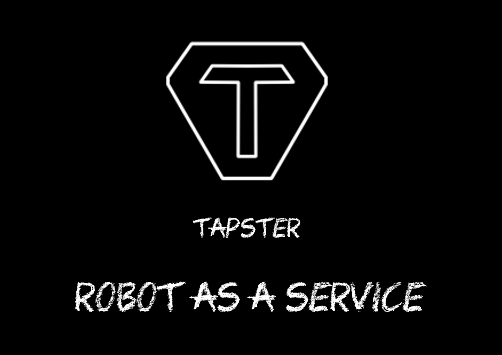

# Important notice

This GitHub repository is a fork of the original [Jason Huggin's tapsterbot](https://github.com/hugs/tapsterbot) project.
It contains also improvements (direct or not) from [Dan Cuellar's fork](https://github.com/penguinho/tapsterbot).
Some part of this project have been implemented by myself in my leasure time or work time [Orange], see sources headers for more details.

Several years ago, I noticed the Git history was crappy and fucked up.
Thee were some data leaks, wrong email address was used, got a lot of spam, commits links to the GitHub account's were not created because of bad pseudo... No DCO, no GPG-signing, too heavy files were versioned...
It was a big mess. Trials to clean the history failed, that is the reason why the project was deleted and created again.
Yep, newbie failure between 2016 and 2019, don't remember well. I am not proud at all, and that case is a "good" example for my students (>_<)

The project has been spotted here:
- [Why not Tapster?](https://speakerdeck.com/pylapp/why-not-tapster) 
- [Tapsterbot - What movie should I see tonight](https://tube.seditio.fr/videos/watch/48bde32b-76b5-4d3b-8b94-2f6a3e4b391b)
- [Tapsterbot - Talking to it with Snips](https://tube.seditio.fr/videos/watch/81be56b0-2f1e-4eae-a379-7a769ccca9ce)
- [Tapster — Robot as a Service 🤖](https://write.as/pylapp/tapster-robot-as-a-service)
- [Tapster - Robotic Test Automation](https://es.linkedin.com/pulse/tapster-robotic-test-automation-jose-pablo-sarco)

# Tapster - Mobile Automation Robot

## Why using such bot?
- Bring fun in your office
- Bring automation for your tests
- Extend your software-based instrumented tests (using UI Automator, Espresso, Kakao, Appium or whatever) with hardware-based tests
- Improve quality of your products
- Deal with secured elements on which no software can click
- Be as close as possible of the ideal use case (users use their fingers to click :3)
- Get a new tool for software development and mobile app tests: robots!

## Some references and things to see
- http://www.tapster.io (the creator of the Tapster bots)
- https://twitter.com/tapsterbot
- https://www.tindie.com/products/hugs/tapster/
- https://github.com/hugs/tapsterbot
- https://github.com/tapsterbot/tapsterbot
- https://github.com/appium/appium
- https://github.com/appium/robots
- https://github.com/penguinho/tapsterbot
- https://github.com/jackskalitzky/tapsterbot

## Versions
1. astro - (tag: vAstro) - The base version of the project, with calibrations workflows and assets.
2. bb8 - (tag: vBb8) - Verson with documentation and CURL commands.
3. c3po - (tag: vC3po) - Version with a client (written in Python) to use to drive the bot.
4. chappie - (tag: vChappie) - Version with Robot Framework keywords to use to drive the bot. Improved Python client. Cleaner files tree.
5. case - (tag: vCase) - Version with an Android app which embeds an assistant based on [Snips](https://snips.ai/ "Snips.ai").
6. deckard - (tag: vDeckard) - Version with a Progressive Web App and a version of the server accepting CORS.
7. dalek - (tag: vDalek) - Version with a wrapper for Robot Framework which provides keywords so as to use for Tapster bot in an easy way (with Appium or other automation tools)
8. eve - (tag: vEve) - More features in both sides and clients (stress inputs, multi tap, multi swipes, draw objects...)
9. finalfive - (tag: vFinalfive) - Bug fixes and new Robot Framework keywords, and bring cylons.

## Wanna help?
 - Make an iOS app to drive the robot
 - Add controls in server-side and clients-side to prevent the use of bad parameters (i.e. tap on with x=-42 and y=0.666)
 - Plug a camera to the robot to stream the tests
 - Draw a SVG on your screen (or pick it from your files) and send its XML content to the server so as to make the robot paint the thing :)
 - Integrate Snips assistants within the Progressive Web Apps
 - Define actions in Snips assistants
 - Integrate the use of Tapster inside Appium
 - Deal with coordinates based on landscape mode of devices
 - ... feel free to make pull requests and forks!

## Notice
This fork has been made so as to build a community around Tapster and bring new usages for this incredible tool.
If you want to contact me, please use the appropriate email in the AUTHORS file.

This Tapster (Tapster model 2) is free, open source et open hardware, so feel free to contribute!
